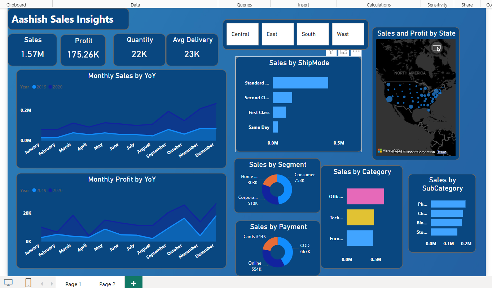
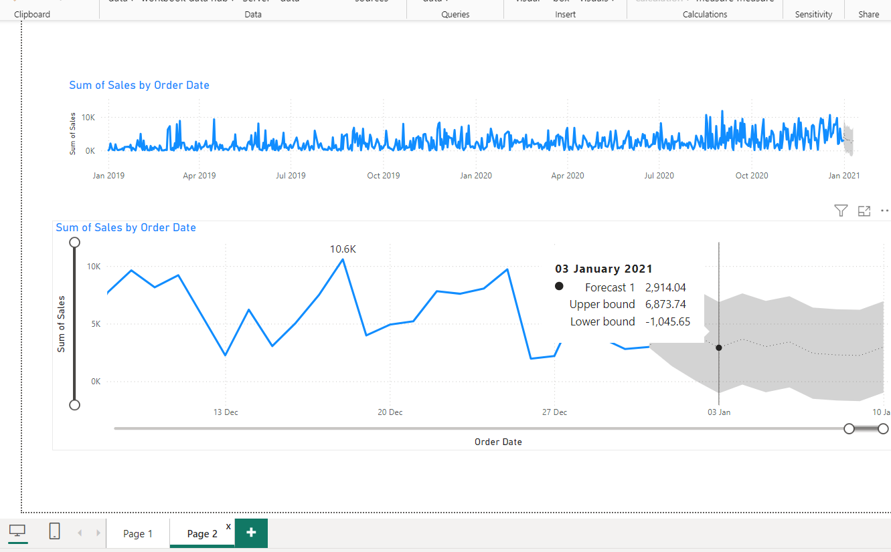

# Sales Forecasting and Data Analysis Project  

## Objective  
To contribute to the success of a business by utilizing **data analysis techniques**, with a specific focus on **time series analysis**, to deliver valuable insights and accurate sales forecasting.  

## Project Components  

### 1. **Dashboard Creation**  
   - Identify **Key Performance Indicators (KPIs)** relevant to sales and business objectives.  
   - Design an **intuitive** and visually appealing dashboard.  
   - Implement **interactive visualizations** and filtering capabilities to allow users to explore data at various levels of granularity.
    



### 2. **Data Analysis**  
   - Utilize data visualizations and charts to evaluate the effectiveness of sales strategies.  
   - Highlight trends, patterns, and areas for improvement.  

### 3. **Sales Forecasting**  
   - Leverage historical sales data to apply **time series analysis** techniques.  
   - Generate **sales forecasts** for the next 15 days to assist in decision-making and resource allocation.
     



### 4. **Actionable Insights and Recommendations**  
   - Provide actionable insights that support **strategic decision-making**.  
   - Deliver recommendations aimed at enhancing growth, operational efficiency, and customer satisfaction.  

## DAX Queries  

### 1. **Average Delivery Time**  
Calculate the average delivery time for each order:  
```DAX
AvgDelivery = DATEDIFF(SuperStore_Sales_Dataset[Order Date], SuperStore_Sales_Dataset[Ship Date], DAY)
```
### 2. Sales Forecasting
Summarize sales data and generate forecasting:

```DAX
SalesForecast = SUMMARIZE(
    'SuperStore_Sales_Dataset',
    SuperStore_Sales_Dataset[Order Date],
    "Total Sales",
    SUM(SuperStore_Sales_Dataset[Sales])
)
```

## Tools and Techniques Used
  - Data Analysis Tools: Power BI
  - Data Manipulation: DAX Queries, Excel
  - Forecasting Methods: Time Series Analysis
  - Visualization Types: Interactive dashboards, line charts, bar charts, and more

## Expected Outcomes
A fully interactive dashboard to explore sales data.
Accurate sales forecasts for better inventory and resource management.
Actionable insights for optimizing sales strategies and enhancing customer satisfaction.

## Conclusion
This project aims to empower businesses with data-driven insights and predictive analytics. By integrating advanced visualization, analysis, and forecasting capabilities, it supports organizational goals of growth, efficiency, and improved customer satisfaction.
